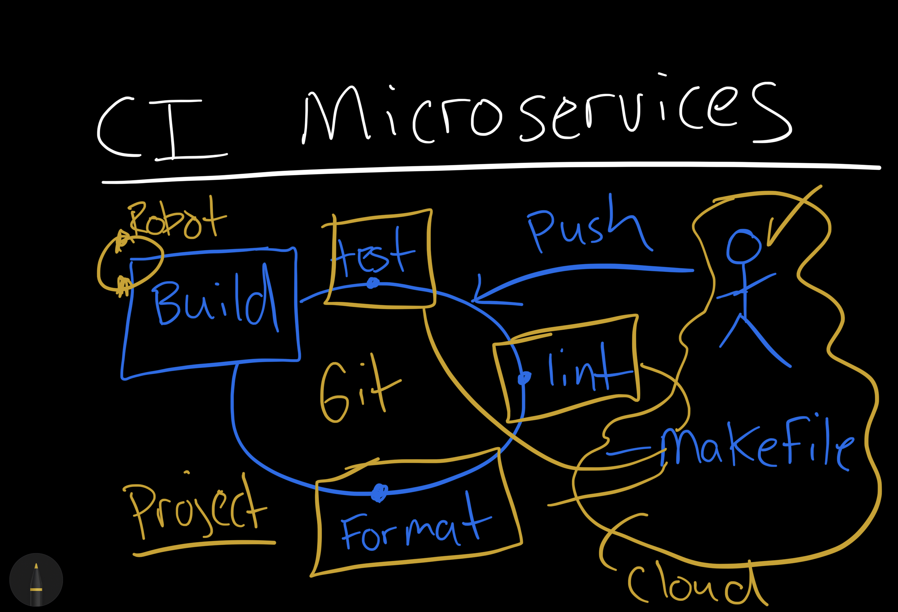

# continuous-integration



This is a sample Python project that demonstrates various development and continuous integration tasks using a Makefile. You can use this project as a reference or template for your own Python projects.

## Getting Started
To get started with this project, follow these steps:

1. Clone the repository:
```
git clone https://github.com/cocnaption/continuous-integration.git
cd continuous-integration
```
2. Setup the Environment
```
python -m venv .venv
source venv/bin/activate
```
3. Install the project dependencies:

```
make install
```
## Available Makefile Targets
* `install`: This target updates pip and installs the project dependencies from requirements.txt.
* `test`: Run the unit tests using pytest. The tests are defined in test_hello.py.
* `format`: Format the Python code using Black.
* `lint`: Run pylint to check the code for issues, disabling specific checks for type hints and conventions.
* `all`: This target combines the install, lint, and test targets, which is useful for continuous integration.

## Continuous Integration
This project includes a basic continuous integration (CI) setup using GitHub Actions. The CI workflow performs the following steps:

1. **Installation**: It installs the project dependencies using the make install target.

2. **Linting**: The code is checked for potential issues using pylint. Specific checks for type hints and conventions are disabled in the CI configuration.

3. **Testing**: The unit tests are executed using pytest.

4. **Formatting**: The code is automatically formatted using Black to ensure consistent coding style.

5. **Deployment (if applicable)**: If your project includes deployment steps, they can be added to the CI workflow as well.

## Usage
You can use this project as a starting point for your own Python projects. Customize the Makefile to include your project-specific tasks and modify the CI configuration files as needed for your chosen CI platform.

License
This project is licensed under the MIT License - see the [LICENSE file](./LICENSE) for details.

## Acknowledgments
Thank you to the open-source community for providing the tools and libraries used in this project.